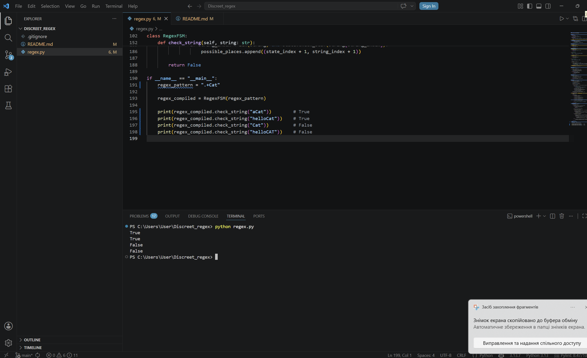

# Discreet_regex

# Звіт

У цій лабораторній роботі я розробилп спрощений regex-движок на основі скінченного автомата. Програма отримує regex-вираз, компілює його у набір станів і потім перевіряє, чи відповідає заданий рядок цьому виразу.

Підтримуються: англійські літери верхнього і нижнього регістру, цифри, символ `.`, який позначає будь-який один символ, оператор `*`, який означає нуль або більше повторень попереднього символу, оператор `+`, який означає одне або більше повторень попереднього символу.

# Пояснення імплементації
Код побудований за ідеєю патерну State, де кожен окремий стан автомата реалізований у вигляді окремого класу. Основою є абстрактний клас State, від якого наслідуються всі інші типи станів. Для кожного стану визначений метод check_self(), який перевіряє, чи відповідає поточний символ певному правилу. Клас AsciiState використовується для перевірки конкретної англійської літери або цифри, DotState приймає будь-який один символ, StarState реалізує оператор *, який дозволяє нуль або більше повторень, а PlusState реалізує оператор +, який дозволяє одне або більше повторень. Також у програмі є службові стани StartState і TerminationState, які відповідають за початок і завершення роботи автомата.

Клас RegexFSM отримує regex-вираз і проходить по ньому посимвольно за допомогою циклу for. Для кожного символу створюється відповідний state через метод __init_next_state(). Під час роботи використовуються змінні prev_state і tmp_next_state: prev_state зберігає попередній стан автомата, а tmp_next_state — щойно створений стан. Усі створені стани також записуються у список regex_states, який потім використовується під час перевірки рядка.

Перевірка рядка виконується у методі check_string(). Для цього використовується список possible_places, у якому зберігаються всі можливі позиції перевірки у форматі (номер стану, номер символу рядка). Далі за допомогою циклу while програма перебирає всі можливі варіанти переходів між станами автомата. Для операторів * і + використовується вкладений цикл while, який дозволяє перевіряти різну кількість повторень символів. Якщо автомат доходить до кінцевого стану і водночас весь рядок уже прочитаний, метод повертає True, інакше — False. Такий підхід дозволяє реалізувати базову роботу regex через скінченний автомат без використання вбудованих бібліотек Python для регулярних виразів.

# Інструкції до запуску
В терміналі:
1. Склонуйте репозиторій:
git clone https://github.com/goldilxcks/Discreet_regex.git

2. Перейдіть у папку проєкту:
cd Discreet_regex

3. Запустіть файл:
python regex.py

Або, якщо не виходить або інша операційна система то:
python3 regex.py
# Як перевірити власний regex або рядок
У файлі `regex.py` внизу програми є блок:

```python
if __name__ == "__main__":
    regex_pattern = "a*4.+hi"

    regex_compiled = RegexFSM(regex_pattern)

    print(regex_compiled.check_string("aaaaaa4uhi"))
```

Щоб перевірити власний regex, потрібно змінити значення змінної:

```python
regex_pattern = "a*4.+hi"
```
Наприклад:
```python
regex_pattern = "b+7."
```
Щоб перевірити власний рядок, потрібно змінити аргумент у методі `check_string()`:
```python
print(regex_compiled.check_string("bbb7x"))
```
Після цього потрібно знову запустити програму:
python regex.py


# Додаткові приклади для перевірки
### Приклад 1
Regex:
```python
regex_pattern = "b+7."
```
Перевірка:
```python
print(regex_compiled.check_string("bbb7x"))  # True
print(regex_compiled.check_string("b7a"))    # True
print(regex_compiled.check_string("7x"))     # False
```

### Приклад 2
Regex:
```python
regex_pattern = "A2*bc"
```
Перевірка:
```python
print(regex_compiled.check_string("Abc"))      # True
print(regex_compiled.check_string("A22bc"))    # True
print(regex_compiled.check_string("A2222bc"))  # True
print(regex_compiled.check_string("Abcx"))     # False
```

### Приклад 3
Regex:
```python
regex_pattern = ".+Z"
```
Перевірка:
```python
print(regex_compiled.check_string("aZ"))       # True
print(regex_compiled.check_string("helloZ"))   # True
print(regex_compiled.check_string("Z"))        # False
```
# Скріншот для перевірки
regex_pattern = ".+Cat"

Перевірки:

print(regex_compiled.check_string("aCat"))        # True
print(regex_compiled.check_string("helloCat"))    # True
print(regex_compiled.check_string("Cat"))         # False
print(regex_compiled.check_string("helloCAT"))    # False


